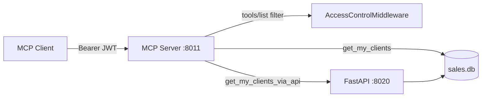

# MCP RBAC Demo (`mcp_rbac`)

JWT-backed **role-based access control (RBAC)** for [FastMCP](https://github.com/jlowin/fastmcp) servers, progressing from simple tool filtering to SQLite-backed salesperson data and a FastAPI bridge over `sales.db`.

This folder is a self-contained lab: three MCP server variants, matching clients, a SQLite initializer, a FastAPI data API, and a JWT helper.

---

## What you learn

1. **Identity-scoped tool visibility** — middleware filters `tools/list` and blocks unauthorized `tools/call`.
2. **JWT verification** — HS256 Bearer tokens carry `identity` / `sub` (and optionally `context.username`).
3. **Data-bound tools** — `get_my_clients` returns only the authenticated salesperson’s rows from SQLite.
4. **MCP → HTTP integration** — `get_my_clients_via_api` delegates the same query to a FastAPI POST endpoint instead of opening SQLite inside the MCP process.

---

## Architecture

### Demo 1 — Basic RBAC

```text
mcp_client_rbac.py  --JWT-->  mcp_server_rbac.py (:8011)
                                 │
                                 ├─ AccessControlMiddleware
                                 ├─ current_time
                                 └─ current_weather
```

### Demo 2 — RBAC + direct SQLite

```text
mcp_client_rbac_sqlite_db.py  --JWT-->  mcp_server_rbac_sqlite_db.py (:8011)
                                              │
                                              ├─ get_my_clients
                                              └─ sales.db (sqlite3)
```

### Demo 3 — RBAC + FastAPI over `sales.db`

```text
mcp_client_rbac_sqlite_db_api.py
        │ Authorization: Bearer <JWT>
        ▼
mcp_server_rbac_sqlite_db_api.py (:8011)
        │
        ├─ get_my_clients ──────────────► sales.db (direct)
        │
        └─ get_my_clients_via_api
                │ POST /clients/query
                ▼
           fastapi_sales_db.py (:8020)
                │
                └─ sales.db
```



---

## Project layout

| File | Role |
|------|------|
| `mcp_server_rbac.py` | Basic MCP server: JWT RBAC for `current_time` / `current_weather` |
| `mcp_client_rbac.py` | Client scenarios A–C (list tools + forbidden call) |
| `mcp_server_rbac_sqlite_db.py` | MCP server + `get_my_clients` reading `sales.db` directly |
| `mcp_client_rbac_sqlite_db.py` | Client scenario D (`get_my_clients`) |
| `mcp_server_rbac_sqlite_db_api.py` | MCP server + direct SQLite **and** FastAPI bridge tool |
| `mcp_client_rbac_sqlite_db_api.py` | Client scenarios D + E (`get_my_clients` / `get_my_clients_via_api`) |
| `fastapi_sales_db.py` | FastAPI app exposing `sales.db` via POST endpoints |
| `init_sqlite_db.py` | Creates/resets `sales.db` with sample salesperson–client rows |
| `generate_jwt_with_username.py` | Builds a JWT with `context.username` for manual testing |
| `sales.db` | SQLite database (generated; do not hand-edit unless you know the schema) |
| `.env` | Secrets and algorithm settings (not committed with real secrets in production) |

---

## Prerequisites

- Python 3.10+ recommended
- A virtual environment with at least:
  - `fastmcp`
  - `fastapi`
  - `uvicorn`
  - `python-dotenv`
  - `mcp` (pulled in by FastMCP)

From the parent repo (example):

```powershell
cd C:\Users\18623\Desktop\PhiAi\mcp_and_agents
.\.venv\Scripts\Activate.ps1
cd mcp_rbac
```

---

## Environment variables

Create or edit `.env` in this directory:

| Variable | Required | Default | Purpose |
|----------|----------|---------|---------|
| `MCP_JWT_SECRET` | **Yes** | — | Shared HS256 secret used to sign/verify JWTs |
| `MCP_JWT_ALGORITHM` | No | `HS256` | Must be `HS256` for these samples |
| `MCP_URL` | No | `http://localhost:8011/mcp` | MCP Streamable HTTP endpoint (clients) |
| `SALES_API_URL` | No | `http://localhost:8020` | FastAPI base URL for `get_my_clients_via_api` |
| `FAPI_JWT_SECRET` | No | — | Present in `.env` for other experiments; **not used** by the current MCP/FastAPI samples |

Example:

```env
MCP_JWT_SECRET=replace-with-a-long-random-secret
MCP_JWT_ALGORITHM=HS256
```

---

## Database: `sales.db`

### Schema

```sql
CREATE TABLE sales_clients (
    id INTEGER PRIMARY KEY AUTOINCREMENT,
    sales_person_name TEXT NOT NULL,
    associate_client_name TEXT NOT NULL
);
```

### Seed data (`init_sqlite_db.py`)

| Salesperson | Clients |
|-------------|---------|
| Alice Chen | Acme Corp, TechStart Inc, Global Solutions |
| Bob Martinez | Retail Plus, Finance Hub |
| Carol Johnson | HealthCare Co, EduTech Ltd |

Initialize or reset:

```powershell
python .\init_sqlite_db.py
```

> **Name note:** RBAC identities include `"Bob Smith"`, while seed rows use `"Bob Martinez"`. Calling client tools as `Bob Smith` will authorize the tool but return an empty client list unless you align the JWT identity with a DB name (e.g. use `Alice Chen` or `Carol Johnson`, or update seed/permissions to match).

---

## Authentication and RBAC

### JWT shape (clients)

Sample clients mint tokens like:

```json
{
  "sub": "Alice Chen",
  "identity": "Alice Chen",
  "iat": 1710000000,
  "exp": 1710003600
}
```

`AccessControlMiddleware` reads `identity` or `sub` and looks it up in `IDENTITY_PERMISSIONS`.

Sales tools also accept username from (in order):

1. Tool argument `auth_token`
2. HTTP header `Authorization: Bearer <token>`

Username extraction for data queries (`_verify_jwt_and_get_username`):

1. `payload.context.username` (if present)
2. else `payload.identity`
3. else `payload.sub`

`generate_jwt_with_username.py` emits the `context.username` style:

```powershell
python .\generate_jwt_with_username.py "Alice Chen"
```

### Permission matrix

| Identity | Allowed tools |
|----------|----------------|
| `identity_1` | `current_time` |
| `identity_2` | `current_time`, `current_weather` |
| `Alice Chen` | `get_my_clients` (+ `get_my_clients_via_api` on API server) |
| `Bob Martinez` | `get_my_clients` (+ `get_my_clients_via_api` on API server) |
| `Carol Johnson` | `get_my_clients` (+ `get_my_clients_via_api` on API server) |

Middleware behavior:

- **`on_list_tools`** — returns only tools in the identity’s allow-set.
- **`on_call_tool`** — raises `ToolError` / Forbidden if the tool is not allowed (even if the client somehow knows the name).

---

## MCP tools reference

### Shared demo tools

| Tool | Description |
|------|-------------|
| `current_time` | UTC ISO-8601 timestamp |
| `current_weather` | Fixed string `"Weather is fine"` |

### Sales tools

| Tool | Server | Data path |
|------|--------|-----------|
| `get_my_clients` | `mcp_server_rbac_sqlite_db.py`, `mcp_server_rbac_sqlite_db_api.py` | Direct `sqlite3` against `sales.db` |
| `get_my_clients_via_api` | `mcp_server_rbac_sqlite_db_api.py` only | `POST {SALES_API_URL}/clients/query` |

Both sales tools return a list of objects with salesperson and client fields (API path also includes `id`).

---

## FastAPI service (`fastapi_sales_db.py`)

Runs on **`0.0.0.0:8020`**.

| Method | Path | Body | Result |
|--------|------|------|--------|
| `GET` | `/health` | — | Service + DB path status |
| `POST` | `/clients/query` | `{"sales_person_name": "Alice Chen"}` | Matching `sales_clients` rows |
| `POST` | `/clients` | `{"sales_person_name": "...", "associate_client_name": "..."}` | Insert row (`201`) |

Interactive docs: [http://localhost:8020/docs](http://localhost:8020/docs)

Example:

```powershell
curl -X POST http://localhost:8020/clients/query `
  -H "Content-Type: application/json" `
  -d "{\"sales_person_name\": \"Alice Chen\"}"
```

---

## How to run

Only **one** MCP server should bind port **8011** at a time. Stop the previous process before switching variants.

### Demo 1 — Basic RBAC

**Terminal A — server**

```powershell
python .\mcp_server_rbac.py
```

**Terminal B — client**

```powershell
python .\mcp_client_rbac.py
```

Expected:

- Scenario A: `identity_1` → `['current_time']`
- Scenario B: `identity_2` → `['current_time', 'current_weather']`
- Scenario C: `identity_1` calling `current_weather` → Forbidden

### Demo 2 — SQLite clients

**Terminal A**

```powershell
python .\init_sqlite_db.py   # once, or to reset
python .\mcp_server_rbac_sqlite_db.py
```

**Terminal B**

```powershell
python .\mcp_client_rbac_sqlite_db.py "Alice Chen"
```

Expected: JSON list of Alice’s three clients.

### Demo 3 — MCP + FastAPI bridge

**Terminal A — FastAPI**

```powershell
python .\fastapi_sales_db.py
```

**Terminal B — MCP API server**

```powershell
python .\mcp_server_rbac_sqlite_db_api.py
```

**Terminal C — client**

```powershell
python .\mcp_client_rbac_sqlite_db_api.py "Alice Chen"
```

Expected:

- Scenario D: clients via direct SQLite (`get_my_clients`)
- Scenario E: same (or equivalent) clients via FastAPI (`get_my_clients_via_api`)

Optional base URL override:

```powershell
$env:SALES_API_URL = "http://localhost:8020"
python .\mcp_server_rbac_sqlite_db_api.py
```

---

## Client scenarios (summary)

| Scenario | Client | What it proves |
|----------|--------|----------------|
| A | `mcp_client_rbac.py` | Restricted `tools/list` for `identity_1` |
| B | `mcp_client_rbac.py` | Broader `tools/list` for `identity_2` |
| C | `mcp_client_rbac.py` | Unauthorized `tools/call` is denied |
| D | sqlite / api clients | Authenticated salesperson reads own clients from DB |
| E | `mcp_client_rbac_sqlite_db_api.py` | Same data path through FastAPI POST |

---

## Ports and URLs

| Service | Default |
|---------|---------|
| MCP (Streamable HTTP) | `http://localhost:8011/mcp` |
| FastAPI sales API | `http://localhost:8020` |
| FastAPI OpenAPI UI | `http://localhost:8020/docs` |

---

## Troubleshooting

| Symptom | Likely cause | Fix |
|---------|--------------|-----|
| `MCP_JWT_SECRET is required` / not configured | Missing `.env` or empty secret | Set `MCP_JWT_SECRET` and restart server/client |
| `Unauthorized identity in JWT payload` | Identity not in `IDENTITY_PERMISSIONS` | Use a known identity (`Alice Chen`, `identity_1`, …) |
| `Forbidden: identity '…' is not allowed to call '…'` | RBAC working as designed | Call an allowed tool for that identity |
| Empty client list for a salesperson | JWT name ≠ `sales_person_name` in DB | Match names (see Bob Smith vs Bob Martinez note) |
| `Sales API unreachable` | FastAPI not running or wrong `SALES_API_URL` | Start `fastapi_sales_db.py`; check port 8020 |
| `Database not found` / 503 | `sales.db` missing | Run `python .\init_sqlite_db.py` |
| Port already in use on 8011 | Another MCP server still running | Stop the other process, then start the desired server |
| Headers not forwarded on some transports | Streamable HTTP quirks | Pass `auth_token` tool argument (clients already do this) |

---

## Security notes (lab only)

- Secrets live in `.env`; do not commit production secrets.
- JWT verification is a compact HS256 sample, not a full OAuth/OIDC stack.
- FastAPI endpoints in this demo are **unauthenticated**; the MCP layer enforces identity. Do not expose `:8020` publicly without adding auth.
- Middleware prints JWT payloads to the server console for debugging — remove that in any shared environment.

---

## Suggested learning path

1. Run Demo 1 and confirm list/call filtering.
2. Initialize `sales.db` and run Demo 2 with `"Alice Chen"`.
3. Start FastAPI + API MCP server and run Demo 3; compare Scenario D vs E responses.
4. Experiment with `generate_jwt_with_username.py` and different identities to see permission and data boundaries.
